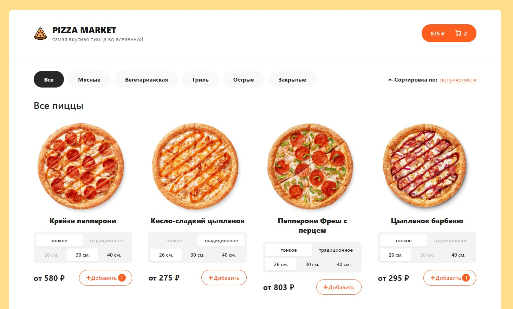

# Pizza Market - online store

What it is:

**Pizza Market**, a React application that brings the pizzeria experience to your fingertips, transforming the way you order, customize, and enjoy your favorite pizza creations. Our user-friendly interface guides you through a simple yet comprehensive ordering process, allowing you to craft your pizza masterpiece with just a few clicks.

Installation:
To build, download the files from the repository and install the dependencies use npm: npm install. After that, type 'npm run dev' in console to run application in development mode, or 'npm run build' to get built bundle (appears in dist folder).

Deployed version you can find [here](https://pizza-market-three.vercel.app/).

Technologies: React, TypeScript, Context API, React Query, SCSS, eslint, Firebase.

Technical features:
- Sort and filter pizzas list
- Implemented cart which contain selected pizzas for order 
- Cart pizzas can delete, increase or decrease pizza count and implement clear cart functionalities
- Using React Context API for state management
- React Query used for asynchronous state management
- Firebase used as backend